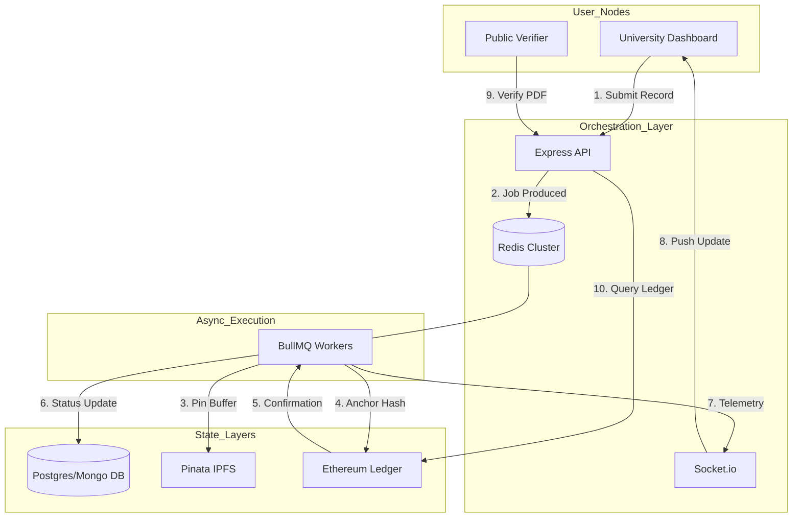

# EduCred System Analysis & Security Audit Report
**Classification:** Internal Technical Audit (Restricted)  
**Auditor:** Principal System Architect  
**Audit Date:** 2026-04-17  
**System Version:** v2.1 (Post-Asynchronous Migration)

---

## 1. System Understanding
EduCred is a Decentralized Application (DApp) designed for the secure issuance and verification of academic credentials. It leverages the Ethereum Blockchain as an authoritative immutable ledger and IPFS as a distributed storage layer. 

**Core Problem Solved:** Eliminates the "Centralized Registrar" bottleneck and solves the "Fragile PDF Hashing" problem by employing deterministic structural data hashing.

**End-to-End Workflow:**
1.  **Institution**: Approved universities input student data → System computes a structural hash → Job enqueued to BullMQ.
2.  **Pipeline**: Worker generates PDF → Pins to IPFS → Anchors hash on-chain using university-specific wallet signatures.
3.  **Verification**: Verifier uploads PDF → Backend extracts structural hash → Queries Sepolia for anchor authenticity.

---

## 2. Architecture Breakdown

The system employs a **Decoupled 6-Layer Stack**:
1.  **Frontend (React/Vite)**: Enterprise UI with real-time WebSocket telemetry.
2.  **API Services (Node.js/Express)**: Stateless middleware handling Auth (JWT) and Job Production.
3.  **Message Broker (Redis/BullMQ)**: Asynchronous lifecycle management and failure retry logic.
4.  **Registry (SQL-Hybrid)**: Sequelize-managed metadata for fast search and audit trails.
5.  **Distributed Storage (IPFS/Pinata)**: Peer-to-peer file persistence for PDF binaries.
6.  **Trust Protocol (Ethereum/Solidity)**: Deterministic validator for academic claims.

---

## 3. Architecture Diagram



---

## 4. Complete System Flows

### A. University Flow
- **Onboarding**: Registration → Document upload → Admin manual review.
- **Identity Formation**: Upon approval, the server generates a bip39-compliant wallet. The Admin authorizes this wallet on the `EduCred.sol` contract via `addIssuer()`.

### B. Certificate Issuance Flow
- **Input**: REST POST request with student metadata.
- **Hashing**: `generateStructuralHash()` creates a deterministic JSON SHA-256 fingerprint.
- **Storage**: PDF is generated with embedded QR (JSON payload) and pinned to IPFS.
- **Finality**: Hash is anchored on Sepolia; receipt is stored in the Registry.

### C. Student Flow
- Students log in via secured JWT session to view their issued records stored in the Registry and can download the source certificates from IPFS via the gateway.

### D. Verification Flow
- **Trustless**: Verifier uploads PDF → `pdf-parse` extracts the syntax-matched `Structural Hash`.
- **Validation**: System queries `EduCred.verifyHash(hash)` on-chain. Matching `validCertificates[hash] == true` confirms authenticity.

---

## 5. Internal Working (Deep Technical)

### 5.1 Structural Hashing Logic
The system implements a **Canonical Serialization Strategy**. It sorts object keys alphabetically and trims whitespace before hashing. This ensures that even if the student's email case changes slightly, the identity remains bit-perfect.
```javascript
// server/utils/hashing.js
export function getDeterministicJSON(obj) {
  const sortedKeys = Object.keys(obj).sort();
  // ... maps and joins to ensure order ...
}
```

### 5.2 Wallet-Sovereign Signing
Unlike prototypes using a "System Key," EduCred uses the issuing university's private key stored in the DB to sign `storeCertificate` calls. This ensures **Non-Repudiation**; only the authorized university could have anchored that specific hash.

---

## 6. Codebase Analysis

### Folder Structure
- `/server/controllers`: Monolithic. The issuance logic in `certificateController.js` is quite large (~500 lines) and could benefit from further decomposition into services.
- `/server/services/registryService.js`: Implements a **Hybrid Adapter Pattern** with a "Simulation Mode" fallback. While clever for dev, the duplication of logic for `isSimulation` checks across all CRUD methods is a **Code Smell**.

### Separation of Concerns
- **Weakness**: `adminController.js` handles wallet generation, DB state, and blockchain interaction within a single `approveUniversity` function.
- **Fix**: Extract Wallet Generation into a dedicated `IdentityService`.

---

## 7. Security Audit

### [CRITICAL] Cryptographic Key Risk
*   **Vulnerability**: University private keys are stored as raw strings in the `University` table (`encryptedPrivateKey`).
*   **Impact**: A database compromise exposes all University identities, allowing an attacker to issue fraudulent certificates on-chain.
*   **Fix**: Implement **Envelope Encryption** (KMS) or move keys to a dedicated Secret Manager (HashiCorp Vault).

### [HIGH] File Upload Vulnerabilities
*   **Vulnerability**: `multer` is used for file uploads, but strict MIME-type sniffing is not enforced on the buffer level.
*   **Impact**: Potential for Polyglot attacks or file-based RCE if the parsing engine (`pdf-parse`) is exploited.

### [MEDIUM] API Integrity
*   **Vulnerability**: No **Anti-CSRF** tokens are visible in the React frontend; reliance is strictly on `httpOnly` cookies.
*   **Risk**: Potential for Cross-Site Request Forgery if the application is accessed alongside a malicious site.

---

## 8. Bugs & Logical Issues

### [BUG] Nonce Collision Race Condition
*   **Issue**: In `workers.js`, if multiple jobs are processed simultaneously for the *same* university (high-volume batch), the `ethers` signer may attempt to send two transactions with the same nonce, causing "Nonce already used" errors.
*   **Fix**: Implement a per-wallet **Distributed Lock** or a nonce-management singleton in the worker.

### [EDGE CASE] IPFS Ghosting
*   **Issue**: If Pinata fails during the worker cycle, the file falls back to local storage. However, the blockchain anchor proceeds. 
*   **Risk**: A certificate might be "Valid" on-chain but the file is "Unavailable" to the student if the local server’s `/uploads` is wiped.

---

## 9. Performance & Scalability

- **Bottleneck**: The use of `sequelize.sync({ alter: true })` in the `registryService.init()` is slow for large schemas.
- **Queue Efficiency**: BullMQ is excellent, but currently uses a single worker thread. Horizontal scaling (multiple worker nodes) is necessary for high-volume batches.
- **CSV Ingestion**: The streaming `csv-parser` fixes the memory heap issue, but still binds CPU during structural hash generation for thousands of rows.

---

## 10. Design Flaws

1.  **Simulation Fallback Anti-Pattern**: The `RegistryService` automatically falling back to in-memory storage in dev-mode (`isSimulation`) makes the development environment behave fundamentally differently from production. This often hides database indexing issues until it’s too late.
2.  **Over-Engineering**: The `BlockchainBackground` component in the frontend uses heavy Canvas/WebGL for a purely administrative tool. While aesthetic, it may significantly impact performance on lower-end registrar machines.

---

## 11. Improvement Plan

### Phase 1: Immediate (Security Hardening)
- [ ] Implement AES-256-GCM encryption for `encryptedPrivateKey`.
- [ ] Add nonce tracking in `workers.js`.
- [ ] Implement CSRF protection middleware (`csurf` or equivalent).

### Phase 2: Short-Term (Refactoring)
- [ ] Decompose `certificateController.js` into modular service files.
- [ ] Remove `isSimulation` from `registryService` in favor of a proper local SQLite/Docker-Compose DB.

### Phase 3: Long-Term (Infrastructure)
- [ ] Migrate to **Merkle-Tree Tree Batching** for Smart Contracts (anchoring 1000 certs in 1 Tx).
- [ ] Move institutional keys to **AWS KMS** or **Azure Key Vault**.

---

## 12. Failure Scenarios

| Scenario | System Behavior | Remediation Path |
| :--- | :--- | :--- |
| **Blockchain Offline** | Worker retries with exponential backoff (BullMQ policy). | Manual intervention to check RPC URL/Balance. |
| **Worker Crashes** | Job remains in Redis "In-Progress" until timeout, then retries. | Restart worker process; use PM2 for auto-restart. |
| **Registry/DB Desync** | Certificate ID exists in DB but Hash not found on Sepolia. | Re-run the anchor job for that specific `certDbId`. |

---

## 13. Production Readiness Checklist
- [x] **Rate Limiting**: Implemented in `index.js`.
- [ ] **Logging**: Move from `console.log` to a structured logger (Winston/Pino) with CloudWatch/ELK support.
- [ ] **Monitoring**: Add health endpoints for Redis and IPFS latency.
- [x] **Secure Cookies**: `httpOnly`, `secure`, and `sameSite` are correctly configured.

---

## 14. Final Verdict

**System Level:** **BETA (Late-Stage)**

**Verdict:** EduCred is **NOT YET PRODUCTION-READY** in its current cryptographic storage state. While the architectural flow (BullMQ + Structural Hashing) is elite and superior to standard prototypes, the **plaintext storage of university private keys** represents a catastrophic risk that must be remediated before institutional deployment.

**Brutally Honest Recommendation**: Correct the Key Vaulting logic immediately. Once institutional keys are secured via KMS, the system will move from a Beta prototype to an **Enterprise-Grade** infrastructure.
