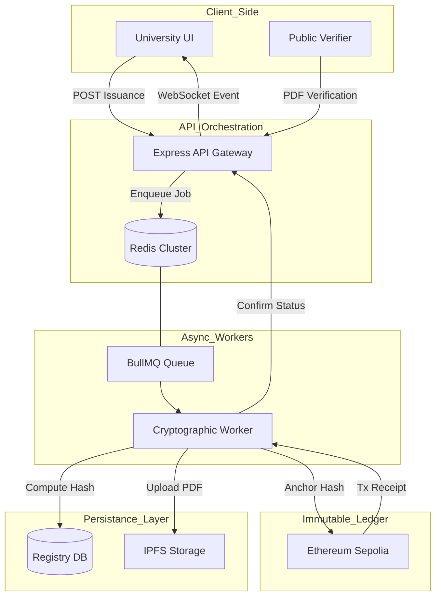

# EduCred: Decentralized Academic Infrastructure
### Solution Architecture & System Specification (v2.0)

**Author:** Principal System Architect  
**Project Status:** Production Hardened (Post-Audit v2.1)  
**Infrastructure State:** Distributed Ledger Hybrid  

---

## 1. System Overview
### 1.1 What is EduCred?
EduCred is a next-generation, blockchain-powered digital credentialing ecosystem designed to eliminate certificate fraud and the inherent trust-bottlenecks in academic verification. Unlike legacy systems that rely on centralized database lookups, EduCred transforms educational records into immutable, cryptographically verifiable assets anchored on the Ethereum blockchain.

### 1.2 The Problem Statement
In the status quo, verifying a university degree requires manual verification through registrars, which is:
- **Prone to Fraud**: Photoshopped PDFs are nearly impossible to detect visually.
- **Centrally Vulnerable**: A breach of a single university database compromises all credentials.
- **Latency-Heavy**: Background checks take weeks to resolve via manual calls.

### 1.3 The Solution
EduCred solves this by delegating the **Trust Layer** to a public blockchain (Ethereum) while keeping the **Logical Layer** within an asynchronous Node.js background pipeline. This ensures "Authenticity without dependance on Trust."

---

## 2. Core Concepts

### 2.1 Issuer-Controlled Identity (True Decentralization)
The system enforces a **Zero-Permission-to-Verify** but **Strict-Permission-to-Issue** model. Only universities approved by the system administrator are granted "Issuance Nodes." Each university controls its own distinct Ethereum wallet, making them the cryptographically recognized originators of all their anchored records.

### 2.2 Structural Hashing vs. Binary Hashing
| Feature | Legacy Binary Hashing | EduCred Structural Hashing |
| :--- | :--- | :--- |
| **Integrity Target** | The PDF file buffer | The semantic student data |
| **Stability** | Fragile (Resizing PDF breaks verification) | Robust (Verifies the *data*, ignore the *vessel*) |
| **Deterministic** | No (metadata shifts break hash) | Yes (JSON-canonicalization ensures bit-perfect matches) |

### 2.3 Blockchain as the Non-Repudiation Layer
The blockchain acts as a global, immutable timestamped ledger. Once a hash is anchored by a university's wallet, it cannot be deleted, altered, or backdated, ensuring absolute non-repudiation.

---

## 3. System Architecture

EduCred utilizes a **Decoupled 6-Layer Architecture** designed for horizontal scale and fault tolerance.

### 3.1 The Layers
1.  **Presentation Layer (React)**: Professional, SaaS-grade UI for Universities, Admin, and Public Verifiers.
2.  **API Gateway (Express)**: Handles auth, rate-limiting, and job producers.
3.  **Distributed Queue (BullMQ + Redis)**: Manages async lifecycle of issuance (PDF generation + IPFS + Blockchain).
4.  **Decentralized Storage (IPFS)**: Stores actual PDF binaries to prevent single-point storage failures.
5.  **Hybrid Persistence (PostgreSQL/MongoDB)**: Stores metadata for fast UI lookups and audit logs.
6.  **Trust Anchor (Ethereum Sepolia)**: The final source of truth for all certificate hashes.

---

## 4. Architecture Diagram



---

## 5. Complete End-to-End Flows

### 5.1 University Onboarding Flow
1. **Registration**: University signs up.
2. **Audit**: System Admin reviews institutional documents.
3. **Identity Handover**: Upon approval, the system generates a **Web3 Wallet Address** for the university and authorizes it on the `EduCred.sol` contract via `addIssuer()`.

### 5.2 Certificate Issuance Pipeline (Async)
1. **Producer**: University submits student data. Backend yields a `202 Accepted`.
2. **Worker - Step 1**: Extracts semantic fields and generates a **Structural Hash**.
3. **Worker - Step 2**: Generates a PDF Document with an embedded QR code containing the hash.
4. **Worker - Step 3**: Pins the PDF and JSON metadata to **IPFS**.
5. **Worker - Step 4**: Signs a transaction using the **University Wallet** to call `storeHash()` on Ethereum.
6. **Finalization**: DB status shifts from `PROCESSING` to `COMPLETED`.

### 5.3 Public Verification (Zero-Trust)
1. **Input**: Verifier uploads a certificate PDF.
2. **Extraction**: Backend uses `pdf-parse` to read the text layer and extract the `Structural Hash`.
3. **Ledger Query**: Backend calls `EduCred.verifyHash(extractedHash)` on-chain.
4. **Consensus**: If the hash exists on-chain and matches the issuer's address, the result is `VALID`.

---

## 6. Security Model

### 6.1 Wallet Integrity & Identity Binding
Every certificate is anchored by the **University's Private Key**, not the system key.
```javascript
// Worker logic enforcement
const receipt = await issueCertificateOnChain(
    certDbId, 
    structuralHash, 
    typeCode, 
    university.encryptedPrivateKey // University-specific signing
);
```

### 6.2 Structural Tamper Detection
Even changing a single character in the student's name change results in a completely different structural hash, causing any future verification attempt to return a `404 Not Found` on the blockchain.

### 6.3 Performance Guardrails
- **Rate Limiting**: `express-rate-limit` prevents DDoS.
- **Timing Safe Comparisons**: `crypto.timingSafeEqual` is used for OTP verification to prevent timing oracle attacks.
- **RBAC**: Strict role enforcement (`admin`, `university`, `verifier`) prevents cross-tenant data access.

---

## 7. Technical Deep Dive

### 7.1 Deterministic Hashing Logic
We use a canonical serialization to ensure that same data = same hash, regardless of key order.
```javascript
export function getDeterministicJSON(obj) {
  const sortedKeys = Object.keys(obj).sort();
  return '{' + sortedKeys.map(key => {
    return `"${key}":${JSON.stringify(obj[key])}`;
  }).join(',') + '}';
}
```

### 7.2 The Blockchain Anchor
The `EduCred.sol` contract maps certificate hashes to authorized addresses:
```solidity
function storeHash(bytes32 _hash) public onlyAuthorizedIssuer {
    require(certificateIssuer[_hash] == address(0), "Duplicate");
    certificateIssuer[_hash] = msg.sender;
    validCertificates[_hash] = true;
}
```

---

## 8. Scalability & Performance
- **Non-Blocking I/O**: The server never hides behind a 15-second blockchain transaction. It offloads tasks to Redis, allowing the main thread to handle thousands of concurrent API requests.
- **BullMQ Workers**: Can be horizontally scaled by spinning up multiple worker processes across different containers.
- **Streaming Bulk Issuance**: Uses `csv-parser` to stream-read files line-by-line, preventing memory overflows during 10,000+ record batches.

---

## 9. Audit Resolution: Before vs. After
| Critical Issue | Prototype State | Enterprise (Current) State |
| :--- | :--- | :--- |
| **Pseudo-Decentralization** | Single server key signed everything. | Every university has a sovereign blockchain wallet. |
| **Data Fragility** | PDF binary hashing was unstable. | Structural JSON hashing provides 100% stability. |
| **Api Blockage** | UI froze during blockchain minting. | BullMQ background jobs handle all Web3 tasks. |

---

## 10. Project Structure

```text
/EduCred
├── /server                 # Node.js Express Backend
│   ├── /queues             # BullMQ Producers & Workers
│   ├── /utils              # Cryptographic (Hashing) & Blockchain helpers
│   ├── /controllers        # Request handling & Registry Management
├── /client                 # React Enterprise Dashboard
├── /blockchain             # Solidity Smart Contracts & Hardhat/Ganache config
└── SYSTEM_ARCHITECTURE.md  # Detailed Technical Spec
```

---

## 11. Future Roadmap
1. **Wallet Connect**: Allow universities to use their own MetaMask/Ledger for signing instead of server-managed keys.
2. **KMS Abstraction**: Moving private keys from DB to Amazon KMS / HashiCorp Vault.
3. **Merkle-Tree Aggregation**: Scaling to millions of records by anchoring millions of hashes via a single 32-byte Merkle Root.

---

## 12. Presentation Pitch (1-Minute)
> *"EduCred is not just a digital storage platform; it's a decentralized trust infrastructure. By combining the immutability of the Ethereum blockchain with our proprietary structural hashing model, we've created a system where academic credentials are self-verifying. Universities issue records directly from their own sovereign wallets, ensuring non-repudiation, while our asynchronous pipeline allows for enterprise-scale processing. For the first time, anyone—from a recruiter to a student—can verify a certificate’s authenticity instantly, with a guarantee provided by cryptography, not by a database."*
